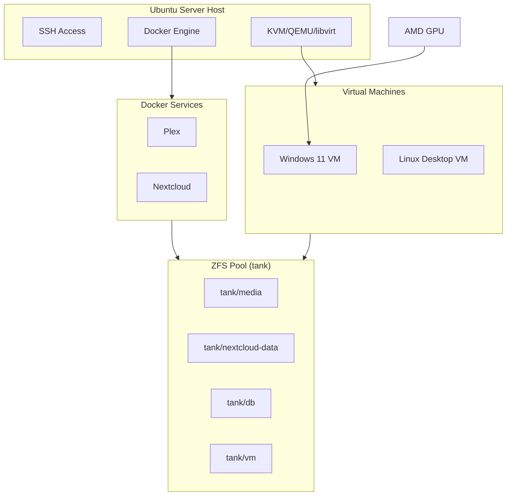

# Software Architecture

This page describes the software layer design. For hardware architecture, see [Hardware Architecture](hardware-architecture.md).

## System Design

## High-Level Goals

### Host OS is Boring

- Ubuntu Server LTS
- No desktop environment
- SSH-only management

### Data Lives Outside Containers

- ZFS is the source of truth
- Containers are disposable
- Bind mounts for all persistent data

### Virtual Machines are First-Class

- KVM/QEMU on the host
- GPU passthrough for Windows/Linux VMs
- No containers around virtualization

### Services are Containerized

- Docker + Compose
- Bind mounts into ZFS datasets
- Config and data separated

### Everything is Recoverable

- Reinstall host without touching data
- ZFS snapshots for point-in-time recovery
- Backups for disaster recovery

## Component Separation

| Layer | Responsibility | Technology |
|-------|----------------|------------|
| Hardware | Physical resources | MS-S1 MAX |
| Host OS | Networking, virtualization | Ubuntu Server |
| Storage | Data persistence | ZFS |
| Compute (VM) | Full OS workloads | KVM/QEMU |
| Compute (Container) | Services | Docker |

## Display Model

The HDMI output is owned by the VM, not the host:

- GPU is passed through to Windows VM
- Monitor connects directly to GPU
- Host is managed over SSH
- VNC/RDP/SPICE are admin tools only

!!! info
    Once GPU passthrough is enabled, the GPU may no longer be available to the host console.
