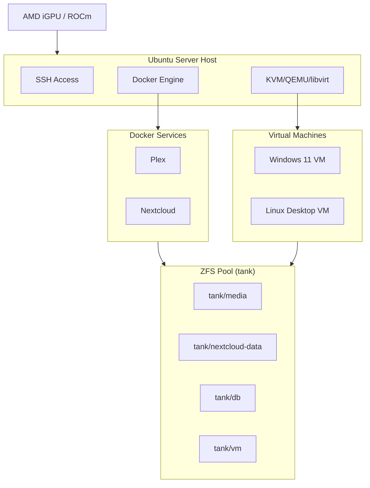

# Software Architecture

This page describes the software layer design. For hardware architecture, see [Hardware Architecture](hardware-architecture.md).

## System Design

```mermaid
graph TB
    subgraph Host["Ubuntu Server Host"]
        SSH[SSH Access]
        KVM[KVM/QEMU/libvirt]
        Docker[Docker Engine]
    end

    subgraph Storage["ZFS Pool (tank)"]
        Media[tank/media]
        NC[tank/nextcloud-data]
        DB[tank/db]
        VM[tank/vm]
    end

    subgraph VMs["Virtual Machines"]
        Win11[Windows 11 VM]
        LinuxVM[Linux Desktop VM]
    end

    subgraph Services["Docker Services"]
        Plex[Plex]
        Nextcloud[Nextcloud]
    end

    GPU[AMD iGPU / ROCm] --> Host
    KVM --> VMs
    Docker --> Services
    Services --> Storage
    VMs --> Storage
```

## High-Level Goals

### Host OS is Boring

- Ubuntu Server LTS
- No desktop environment
- SSH-only management

### Data Lives Outside Containers

- ZFS is the source of truth
- Containers are disposable
- Bind mounts for all persistent data

### Virtual Machines are First-Class

- KVM/QEMU on the host
- No GPU passthrough by default — the iGPU stays with the host for ROCm; the Windows 11 VM uses virtio-gpu
- No containers around virtualization

### Services are Containerized

- Docker + Compose
- Bind mounts into ZFS datasets
- Config and data separated

### Everything is Recoverable

- Reinstall host without touching data
- ZFS snapshots for point-in-time recovery
- Backups for disaster recovery

## Component Separation

| Layer | Responsibility | Technology |
|-------|----------------|------------|
| Hardware | Physical resources | MS-S1 MAX |
| Host OS | Networking, virtualization | Ubuntu Server |
| Storage | Data persistence | ZFS |
| Compute (VM) | Full OS workloads | KVM/QEMU |
| Compute (Container) | Services | Docker |

## Display Model

By default the host is headless and the iGPU stays with the host:

- The host runs without a graphical console and is managed over SSH
- The single HDMI output is mostly unused — it is only needed for BIOS access and the initial install
- The iGPU is owned by the host for ROCm / AI inference
- VMs get a virtual display via virtio-gpu (Spice/VNC), and the Windows 11 VM is reached over RDP

!!! info "GPU passthrough is an optional trade-off"
    Passing the iGPU through to a VM is possible but not the default: it takes the GPU away from the host, so host ROCm / AI inference goes offline whenever that VM runs. See [GPU Passthrough](../virtualization/gpu-passthrough.md) and [Windows 11 VM](../virtualization/windows-vm.md) for the trade-off and the default virtio-gpu setup.
